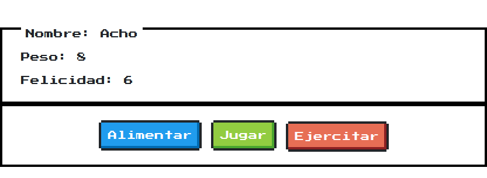

# ¡Apuntes! #




## Iteración 1: Un título, un panda cualquiera y sus características. ##

En esta iteración nos centraremos en:

- Poner un título a nuestra aplicación
- Pondremos también una imágen para "dar alegría"
- Dibujaremos las caracterísitcas que queremos ver de nuestro panda

### Un título ###

#### HTML - Elementos títulos o encabezados #####

Los elementos de encabezado implementan seis niveles de encabezado del documento, `<h1>` es el más importante, y `<h6>`, el menos importante.

```html
<h1>texto</h1>
<h2>texto</h2>
<h3>texto</h3>
<h4>texto</h4>
<h5>texto</h5>
<h6>texto</h6>
```

### Una imagen ###

#### HTML - Imagen ####

El elemento de imagen HTML `` representa una imagen en el documento.

```html

```

Usaremos la siguiente imagen: https://3.bp.blogspot.com/-xKTu7NmDIzM/VO3EFSZbAlI/AAAAAAAAHPo/f3BDecJDFn8/s1600/panda.gif

Quedaría así (podéis copiar, nadie os juzgará):

```html

```

### Las características ###

#### HTML - Sección ####

El Elemento de HTML `<section>` representa una sección genérica de un documento.

```html
<section>texto</section>
```

#### HTML - Párrafo ####

El elemento párrafo es el apropiado para distribuir el texto en párrafos.

```html
<p>texto</p>
```


## Iteración 2: Nuestro panda, en una vitrina. ##

### Nuestro panda ###

#### Javascript - objeto panda ####

```javascript
var mascota = {
    nombre: 'Acho',
    peso: 8,
    felicidad: 6
}
```

### La vitrina ###

#### HTML - Span ####

Sirve para aplicar estilo al texto

```html
<span>texto</span>
```

#### HTML - Clases ####

El atributo global class es una lista de las clases del elemento separada por espacios.

```html
<span class="nombre">texto</span>
```

#### Javascript - ¡A pintar! ####

JQuery es una "biblioteca", mal llamada "librería", de Javascript. Hace que interactuar con el HTML sea mucho más fácil.

```javascript
  $('.nombre').text(mascota.nombre)
  $('.peso').text(mascota.peso)
  $('.felicidad').text(mascota.felicidad)
```

[JQuery](https://jquery.com)

[Text](https://api.jquery.com/text/#text)

[Chuleta JQuery](https://oscarotero.com/jquery)


## Iteración 3: Adoptemos el panda y ¡Hagamos cositas con él! ##

### Hagamos cositas con el panda ###

#### Javascript - Función ####

Una función es un fragmento de código que puede ser llamado por otro código.

¿Recordáis esto?

```javascript
  $('.nombre').text(mascota.nombre)
  $('.peso').text(mascota.peso)
  $('.felicidad').text(mascota.felicidad)
```

Pues convirtámoslo en esto:

```javascript
function actualizarHTML() {
  $('.nombre').html(mascota.nombre)
  $('.peso').text(mascota.peso)
  $('.felicidad').text(mascota.felicidad)
}
```

Y, después de ver que no ocurre nada, colocad esto justo después:

```javascript
actualizarHTML()
```


### Hagamos más cositas ###

#### HTML - Botón ####

La etiqueta de HTML `<button>` representa un elemento cliqueable de tipo botón.

```html
<button onclick="dameDeComer()">Haz click aquí</button>
```

#### Javascript - dameDeComer ####

```javascript
function dameDeComer() {
    alert('Dame de comer!')
}
```


## Iteración 4: Ciudemos de nuestro panda ##

Cuidaremos a nuestro panda con 3 acciones:
- Alimentar:
  - +1 felicidad
  - +2 peso
- Jugar:
  - +2 felicidad
  - -1 peso
- Ejercitar:
  - -1 felicidad
  - -1 peso

Al igual que antes, necesitaremos un **botón** para cada una y una **función** asociada

### Alimentar ###

#### HTML - boton ####

```html
<button onclick="alimentar()">Alimentar</button>
```

#### Javascript - alimentar ####

```javascript
function alimentar() {
    mascota.felicidad = mascota.felicidad + 1
    mascota.peso = mascota.peso + 2

    actualizarHTML()
}
```

### Jugar ###

Funciona igual que `alimentar`

### Ejercitar ###

Funciona igual que `alimentar`


## Iteración de lujo: ¡Por Crom que esto lucirá muy "molonamente"! ##

[NES CSS](https://nostalgic-css.github.io/NES.css/)

### Importamos nuestra biblioteca ###

#### CSS - Importar bibliotecas ####

```css
@import url("https://fonts.googleapis.com/css?family=Press+Start+2P");

@import url('https://unpkg.com/nes.css/css/nes.css');
```

##### CSS #####

```CSS
selector {
    propiedad: valor;
}
```

#### CSS - Texto ####

La propiedad font-family define una lista de fuentes o familias de fuentes, con un orden de prioridad, para utilizar en un elemento seleccionado.

```CSS
* {
    font-family: Press Start 2P;
}
```

#### HTML - Aplicar estilo mediante clases ####

##### contenedores #####

```html
<section class="nes-container with-title is-centered">
  <p class="title">Container.is-centered</p>
  <p>Good morning. Thou hast had a good night's sleep, I hope.</p>
</section>
```

##### botones #####

```html
<button class="nes-btn is-primary">Primary</button>
<button class="nes-btn is-success">Success</button>
<button class="nes-btn is-warning">Warning</button>
<button class="nes-btn is-error">Error</button>
```


## Código final ##

### HTML ###

```html
<h1>Mi mascota</h1>

<section class="nes-container with-title">
  <p class="title">Nombre: <span class="nombre"></span></p>
  <p>Peso: <span class="peso"></span></p>
  <p>Felicidad: <span class="felicidad"></span></p>
</section>
<section class="nes-container is-centered">
  <button class="nes-btn is-primary" onclick="alimentar()">Alimentar</button>
  <button class="nes-btn is-success" onclick="jugar()">Jugar</button>
  <button class="nes-btn is-error" onclick="ejercitar()">Ejercitar</button>
  <button class="nes-btn is-warning" onclick="dameDeComer()">Dame de comer!</button>
</section>
```

### CSS ###

```css
@import url("https://fonts.googleapis.com/css?family=Press+Start+2P");

@import url('https://unpkg.com/nes.css/css/nes.css');

* {
   font-family: "Press Start 2P";
}
```

### Javascript ###

```javascript
var mascota = {
  nombre: 'Acho',
  peso: 8,
  felicidad: 6
}

function actualizarHTML() {
  $('.nombre').html(mascota.nombre)
  $('.peso').text(mascota.peso)
  $('.felicidad').text(mascota.felicidad)
}

actualizarHTML()

function dameDeComer() {
  alert('Dame de comer!')
}

function alimentar() {
  mascota.felicidad = mascota.felicidad + 1
  mascota.peso = mascota.peso + 2

  actualizarHTML()
}

function jugar() {
  mascota.felicidad = mascota.felicidad + 2
  mascota.peso = mascota.peso - 1

  actualizarHTML()
}

function ejercitar() {
  mascota.felicidad = mascota.felicidad - 1
  mascota.peso = mascota.peso - 1

  actualizarHTML()
}
```
